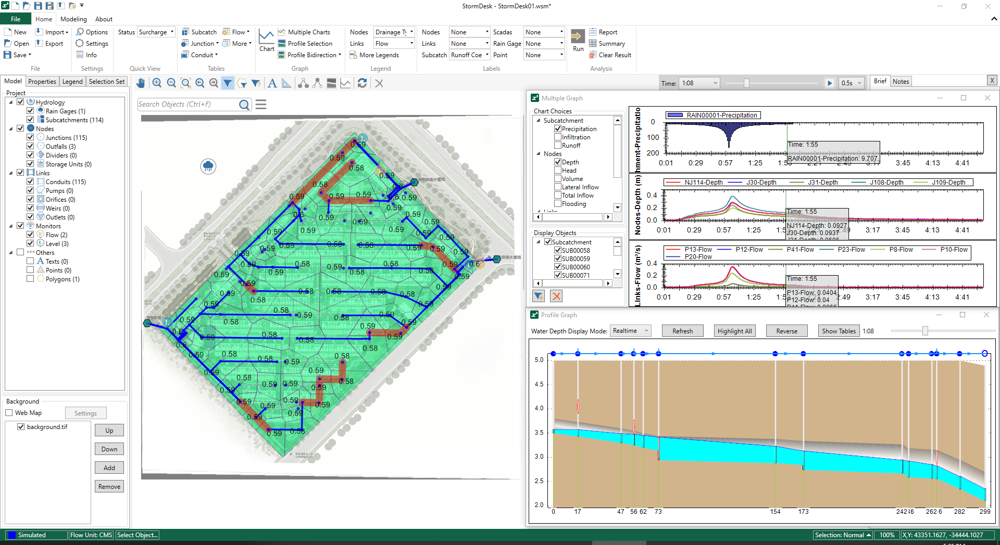

# StormDesk

StormDesk, a fully functional drainage modelling software based on EPASWMM, covers the whole process of 1D Hydrologic and Hydraulic modelling process. In addition, a lot of extra efforts have also been made after adopting the experience of many front-line engineers, to improve user interface and enhance toolboxes, which allow users to focus on the engineering.

As a sister product of [WaterDesk](https://github.com/WaterDesk/WaterDesk-WS), StormDesk is developed by Shanghai Huishui Technology Inc. too!

## System Requirements

- System requirements for StormDesk Educational

  |                      |                                                              |
  | -------------------- | ------------------------------------------------------------ |
  | **Operating System** | 64-bit Microsoft® Windows® 11 and Windows 10                 |
  | **Processor**        | **Basic**: 2.5-2.9 GHz processor with 8 logical cores (base) |
  |                      | **Recommended**: 3+ GHz processor (base), 4+ GHz (turbo)     |
  | **Memory**           | **Basic**: 16 GB                                             |
  |                      | **Recommended**: 64 GB                                       |
  | Display Resolution   | 1920 x 1080 with True Color                                  |
  | Disk Space           | 500G (suggested SSD)                                         |
  | .NET Framework       | .NET Framework 版本 4.8                                      |
  | VC Runtime           | Visual C++ Redistributable for Visual Studio 2015-2022       |

## Release Notes

### version 4.0.4

- fix Date & Number format issue for some non-English/non-Chinese regions
- fix product registration failure due to network issue
- add English version of StormDesk User Application form

### version 4.0.0

- Upgrade to Education Edition
- AI assistant "XIAO HUI" is online
- infer upstream/downstream conduit's elevation
- improve the subcatchment division by Thiessen polygon
- import SCADA points by CSV files
- Some performance and UI improvements, and some bug fixes

### version 3.1.0

- batch edit for "Inflow Type" column in Node Inflow data window (direct pollutant tab)
- refresh conduit layer after inferring width
- add "refresh" button in Network Group window to analysis continuously
- add "Node Surcharge" in Summary Tables
- Some performance and UI improvements, and some bug fixes

### version 3.0.0

- Add <b>Themes</b>, allow users to set theme settings instead of legends to enrich visualizations
- New legend control when a theme is applied
- Import DEM file (\*.asc) as DEM layer with Color Ramp settings, show DEM with Profile Graph, infer Junction elevation from DEM
- New Project Settings window with improved object default display settings
- Upgrade EPASWMM engine to 5.2.4
- Improve selection: polygonal selection, reverse selection, customize selection pick box size, press `SHIFT` to unselect, interactive between selection and Object tables
- Tree view for selection sets
- Context menu of Project Tree: Zoom to layer
- Status bar: turn on/off object tooltip in map
- Localization for LID Control Editor
- Allow copy a LID Control data
- Tools:
  - Find shortest path by given two objects
  - Search sub-networks by given objects
  - Simplify vertices of conduits
  - Join similar neighbor conduits
- Some performance and UI improvements, and some bug fixes

### version 2.1.0

- Some bug fixes

### version 2.0.0

- Add <b>Designing</b> module for rainwater pipeline design with inference formula method, achieving seamless integration between network design and model simulation
- Add rainstorm intensity formula editor
- Enhance importing dxf file as Conduit, Subcatchment, Line, and Polygon
- Some performance and UI improvements, and some bug fixes

### version 1.2.0

- Add general Line object
- Add Velocity SCADA object
- Graph: display precipitation graph together with object results
- Multiple graph: add SCADA object, display precipitation graph together with other objects
- Merge model file (.wsm)
- Add navigation mode settings in status bar: highlight, move, zoom with different levels
- Support hot start for simulation
- Support to covert objects in shape background files to model objects, such as junction, conduit, subcatchment, point, polygon, and etc.
- Data integrity check, data evaluation
- Get Raingage rainfall data from SCADA
- Infer the invert elevation of junction
- Time series expression editor; convert SCADA data to time series by expression
- Model result precision analysis
- Allow not to load result when open a model
- Some performance and UI improvements, and some bug fixes

### version 1.1.0

- Upgrade EPASWMM engine to 5.2.0
- Add Streets cross-section, Inlet object, and [INLET_USAGE] property of conduit, and etc.
- Add Streets model example into the installer
- Quick evaluation of Streets flooding
- Runoff Quantity Continuity analysis
- Data Import: import lines or polylines from DXF file as conduits
- Add Customer Objects with water usage info which can be allocated to adjacent junctions automatically as DWF.
- Support to batch convert objects to other types of node or links
- Support to move network by adjusting X,Y values
- Add a summary table about invisible objects in the right project panel
- Some performance and UI improvements, and some bug fixes

### version 1.0.0

- Full capabilities of EPA SWMM5
- Data Import: INP, Excel, and Shape Files
- Data Export: INP, Shape Files (by object types or selection set)
- Data Table: display data table for all objects or selected objects, allow user to batch edit properties (plus, minus, divide, multiply, assign); data table for Subcatchment Infiltration Data, Node Inflows Data
- Support adding image or shape files as background
- Support online map (Baidu Map and Baidu Earth), allow user to match model to online map by specifying base and reference positions
- Quick chart graph to display result charts for selected objects
- Multiple charts graph to display multiple result properties and multiple objects
- Profile graph for selected links, and bi-direction, up-stream, down-stream profile
- Quick label and custom label setting for objects
- Quick legend, and quick view with surcharging and flooding objects
- Calibration Tool: unique SCADA management module for Flow SCADA and Level SCADA and convenient calibration tools.
- Selection Set
- Tools:
  - Purge conduits and junctions belong to branches
  - Trace up / Trace down
  - Create subcatchments by Thiessen polygons
  - Recalculate conduit's length
  - Recalculate subcatchment's and polygon's area
  - Check the duplicated links
  - Check the duplicated nodes
  - Connection analysis to find all sub-networks
  - Infer link's direction
  - Infer conduit's diameter (or width)
  - Infer ground elevation of nodes
- Search Bar
- Toolbar: Pan, Zoom In, Zoom Out, Zoom Extent, Zoom Previous, Zoom Next, Select, Polygonal Select, Identify, Add Text Label, Measure Distance, Trace Up, Trace Down, Profile Selection, Quick Chart, Refresh, Delete
- Status Bar:
  - Simulation Status
  - Flow Unit
  - Operation Display
  - Selection Mode: Normal and Cycling (allow user to select one from overlapped objects)
  - Scale Ratio
  - Coordinates
- Allow user to add note as history notes when save
- Manual, Video, FAQ
